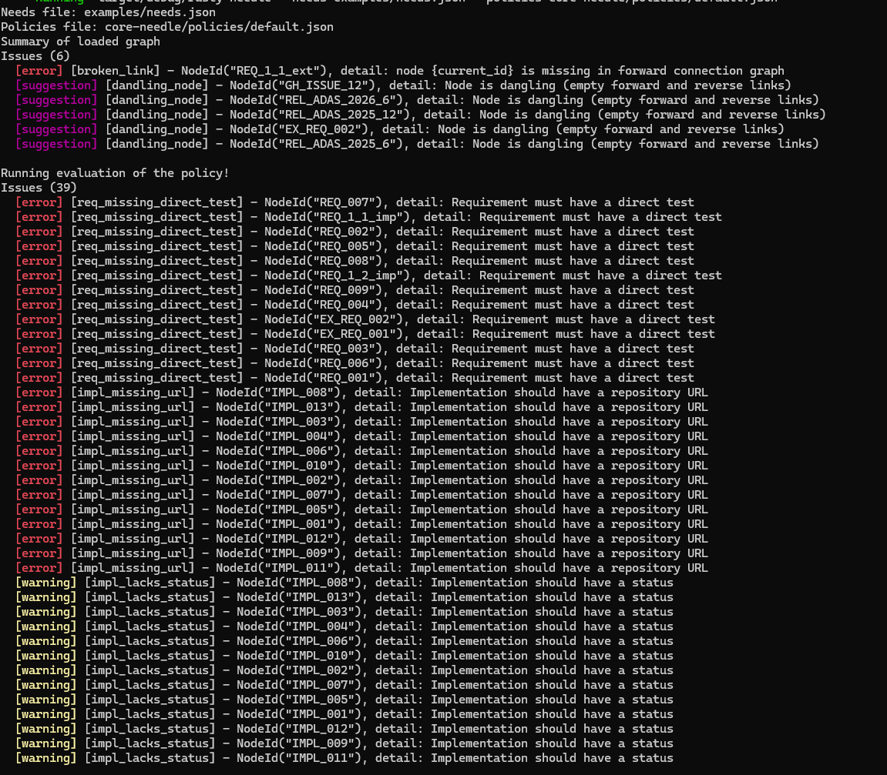

# rusty-needle
**Find the needle in the haystack of requirements**

## Disclaimer

### Legal

This project is an independent, non-commercial experiment created purely for learning and exploration.  
It operates on JSON data **exported by** [Sphinx-Needs](https://useblocks.com) and is intended solely to demonstrate how additional policy-based validation could be implemented on top of that data.  

**rusty-needle** does not claim ownership of, nor attempt to reimplement, any functionality, concepts, or intellectual property belonging to Sphinx-Needs or its authors.  
All rights to the original Sphinx-Needs project, its code, and its data structures remain entirely with the original authors and contributors.  

This project is developed independently, out of respect and appreciation for Sphinx-Needs, and should be viewed as a technical learning exercise, not as a competing or derivative product.

---

**rusty-needle** is a lightweight command-line tool that validates [Sphinx-Needs](https://useblocks.com) JSON exports against custom policy rules.  
It extends the standard Sphinx-Needs validation with additional checks, allowing teams to enforce stricter or project-specific consistency in their requirements data.

---

## Motivation

Sphinx-Needs provides a robust framework for managing requirements within documentation.  
**rusty-needle** introduces an additional validation layer that allows users to define **policies** for enforcing project-specific rules.  

Typical use cases include:

- Ensuring each implementation (`impl`) is linked to at least one requirement.  
- Verifying that the author of a requirement does not approve or validate their own implementation.  
- Checking that every requirement is covered directly or indirectly by a test case.  

This approach helps maintain traceability, accountability, and compliance with internal standards or safety guidelines.

## Usage

## Usage

Run `rusty-needle` on a Sphinx-Needs JSON export with a policy file:

```sh
rusty-needle --needs <path/to/needs.json> --policies <path/to/policy.json>
```

- --needs  - path to the Sphinx-Needs JSON export (default, `examples/needs.json`)
- --policies  - path to a policy JSON (default, `core-needle/policies/default.json`)

### Running with example data

This shall be executed from the project root

```sh
cargo run -- --needs examples/needs.json --policies core-needle/policies/default.json
```

#### Output

Output consists of two runs:

* Preliminary validation conducted while constructing the graph from the needs JSON.
* Validation based on provided policy JSON

```
Needs file: examples/needs.json
Policies file: core-needle/policies/default.json
Summary of loaded graph
Issues (6)
  [error] [broken_link] - NodeId("REQ_1_1_ext"), detail: node {current_id} is missing in forward connection graph
  [suggestion] [dandling_node] - NodeId("EX_REQ_002"), detail: Node is dangling (empty forward and reverse links)
  [suggestion] [dandling_node] - NodeId("REL_ADAS_2026_6"), detail: Node is dangling (empty forward and reverse links)
  [suggestion] [dandling_node] - NodeId("REL_ADAS_2025_6"), detail: Node is dangling (empty forward and reverse links)
  [suggestion] [dandling_node] - NodeId("GH_ISSUE_12"), detail: Node is dangling (empty forward and reverse links)
  [suggestion] [dandling_node] - NodeId("REL_ADAS_2025_12"), detail: Node is dangling (empty forward and reverse links)

Running evaluation of the policy!
Issues (39)
  [error] [req_missing_direct_test] - NodeId("EX_REQ_002"), detail: Requirement must have a direct test
  [error] [req_missing_direct_test] - NodeId("REQ_1_1_imp"), detail: Requirement must have a direct test
  [error] [req_missing_direct_test] - NodeId("REQ_008"), detail: Requirement must have a direct test
  [error] [req_missing_direct_test] - NodeId("REQ_003"), detail: Requirement must have a direct test
  [error] [req_missing_direct_test] - NodeId("REQ_001"), detail: Requirement must have a direct test
  [error] [req_missing_direct_test] - NodeId("REQ_005"), detail: Requirement must have a direct test
  [error] [req_missing_direct_test] - NodeId("REQ_004"), detail: Requirement must have a direct test
  [error] [req_missing_direct_test] - NodeId("EX_REQ_001"), detail: Requirement must have a direct test
  [error] [req_missing_direct_test] - NodeId("REQ_1_2_imp"), detail: Requirement must have a direct test
  [error] [req_missing_direct_test] - NodeId("REQ_009"), detail: Requirement must have a direct test
  [error] [req_missing_direct_test] - NodeId("REQ_007"), detail: Requirement must have a direct test
  [error] [req_missing_direct_test] - NodeId("REQ_002"), detail: Requirement must have a direct test
  [error] [req_missing_direct_test] - NodeId("REQ_006"), detail: Requirement must have a direct test
  [error] [impl_missing_url] - NodeId("IMPL_012"), detail: Implementation should have a repository URL
  [error] [impl_missing_url] - NodeId("IMPL_003"), detail: Implementation should have a repository URL
  [error] [impl_missing_url] - NodeId("IMPL_004"), detail: Implementation should have a repository URL
  [error] [impl_missing_url] - NodeId("IMPL_010"), detail: Implementation should have a repository URL
  [error] [impl_missing_url] - NodeId("IMPL_007"), detail: Implementation should have a repository URL
  [error] [impl_missing_url] - NodeId("IMPL_006"), detail: Implementation should have a repository URL
  [error] [impl_missing_url] - NodeId("IMPL_009"), detail: Implementation should have a repository URL
  [error] [impl_missing_url] - NodeId("IMPL_011"), detail: Implementation should have a repository URL
  [error] [impl_missing_url] - NodeId("IMPL_001"), detail: Implementation should have a repository URL
  [error] [impl_missing_url] - NodeId("IMPL_002"), detail: Implementation should have a repository URL
  [error] [impl_missing_url] - NodeId("IMPL_013"), detail: Implementation should have a repository URL
  [error] [impl_missing_url] - NodeId("IMPL_005"), detail: Implementation should have a repository URL
  [error] [impl_missing_url] - NodeId("IMPL_008"), detail: Implementation should have a repository URL
  [warning] [impl_lacks_status] - NodeId("IMPL_012"), detail: Implementation should have a status
  [warning] [impl_lacks_status] - NodeId("IMPL_003"), detail: Implementation should have a status
  [warning] [impl_lacks_status] - NodeId("IMPL_004"), detail: Implementation should have a status
  [warning] [impl_lacks_status] - NodeId("IMPL_010"), detail: Implementation should have a status
  [warning] [impl_lacks_status] - NodeId("IMPL_007"), detail: Implementation should have a status
  [warning] [impl_lacks_status] - NodeId("IMPL_006"), detail: Implementation should have a status
  [warning] [impl_lacks_status] - NodeId("IMPL_009"), detail: Implementation should have a status
  [warning] [impl_lacks_status] - NodeId("IMPL_011"), detail: Implementation should have a status
  [warning] [impl_lacks_status] - NodeId("IMPL_001"), detail: Implementation should have a status
  [warning] [impl_lacks_status] - NodeId("IMPL_002"), detail: Implementation should have a status
  [warning] [impl_lacks_status] - NodeId("IMPL_013"), detail: Implementation should have a status
  [warning] [impl_lacks_status] - NodeId("IMPL_005"), detail: Implementation should have a status
  [warning] [impl_lacks_status] - NodeId("IMPL_008"), detail: Implementation should have a status
  ```



### Limitations

* Currently only single policy file is acceptable
* Currently only single needs file is acceptable

### TODO
* Creation of URL accessor checking policies for provided `URL`
* Supporting multiple JSON files - merging
* Support better outputs e.g Web via REST/WebSockets
* Support multiple needs files
* Describe policy scheme
* Describe how to define custom policies
* Proper testing
* Fix `use` warnings


